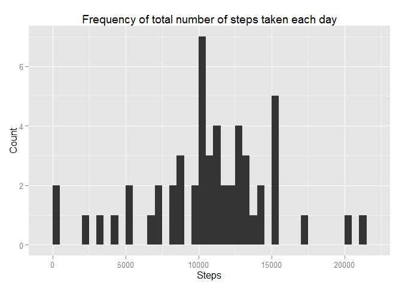
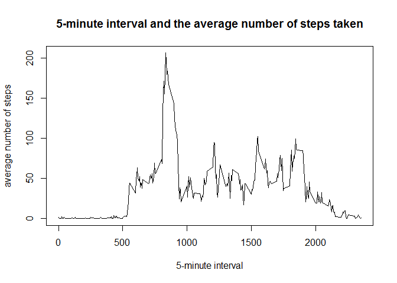
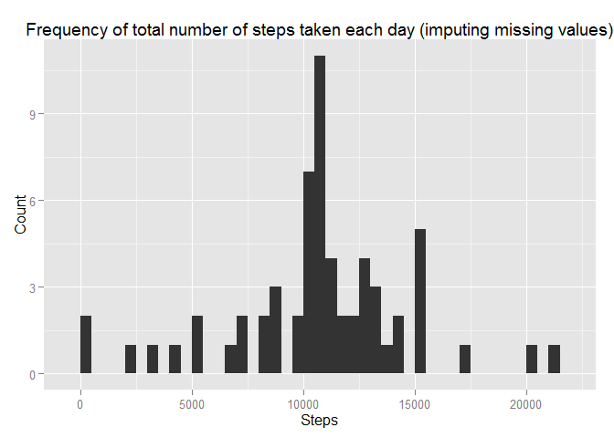
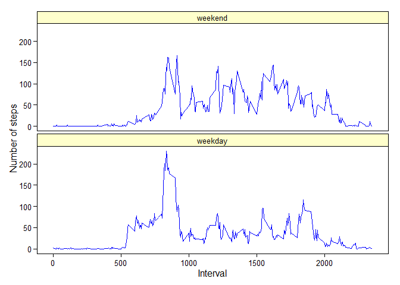

# Reproducible Research: Peer Assessment 1


## Loading and preprocessing the data

### 1. Load the data

```r
activity <- unzip("activity.zip")
data <- read.csv(activity)
```

### 2. Process / transform the data

```r
data$date <- as.Date(data$date)
```

## What is mean total number of steps taken per day?

### 1. Total of steps taken per day

```r
# Calculate the total number of steps taken per day (default ignores missing values)
stepsPerDay <- aggregate(steps ~ date, data=data, sum)
stepsPerDay
```

```
##          date steps
## 1  2012-10-02   126
## 2  2012-10-03 11352
## 3  2012-10-04 12116
## 4  2012-10-05 13294
## 5  2012-10-06 15420
## 6  2012-10-07 11015
## 7  2012-10-09 12811
## 8  2012-10-10  9900
## 9  2012-10-11 10304
## 10 2012-10-12 17382
## 11 2012-10-13 12426
## 12 2012-10-14 15098
## 13 2012-10-15 10139
## 14 2012-10-16 15084
## 15 2012-10-17 13452
## 16 2012-10-18 10056
## 17 2012-10-19 11829
## 18 2012-10-20 10395
## 19 2012-10-21  8821
## 20 2012-10-22 13460
## 21 2012-10-23  8918
## 22 2012-10-24  8355
## 23 2012-10-25  2492
## 24 2012-10-26  6778
## 25 2012-10-27 10119
## 26 2012-10-28 11458
## 27 2012-10-29  5018
## 28 2012-10-30  9819
## 29 2012-10-31 15414
## 30 2012-11-02 10600
## 31 2012-11-03 10571
## 32 2012-11-05 10439
## 33 2012-11-06  8334
## 34 2012-11-07 12883
## 35 2012-11-08  3219
## 36 2012-11-11 12608
## 37 2012-11-12 10765
## 38 2012-11-13  7336
## 39 2012-11-15    41
## 40 2012-11-16  5441
## 41 2012-11-17 14339
## 42 2012-11-18 15110
## 43 2012-11-19  8841
## 44 2012-11-20  4472
## 45 2012-11-21 12787
## 46 2012-11-22 20427
## 47 2012-11-23 21194
## 48 2012-11-24 14478
## 49 2012-11-25 11834
## 50 2012-11-26 11162
## 51 2012-11-27 13646
## 52 2012-11-28 10183
## 53 2012-11-29  7047
```

### 2. Histogram of the total number of steps taken each day

```r
library(ggplot2)
qplot(stepsPerDay$steps, geom="histogram", xlab = "Steps", ylab = "Count", 
      main = "Frequency of total number of steps taken each day", binwidth = 500)
```

 

### 3. Mean of the total number of steps taken per day:  

```r
meanSteps <- mean(stepsPerDay$steps)
meanSteps
```

```
## [1] 10766.19
```

###    Median of the total number of steps taken per day:

```r
medianSteps <- median(stepsPerDay$steps)
medianSteps
```

```
## [1] 10765
```

## What is the average daily activity pattern?

### 1. Time series plot of the 5-minute interval and the average number of steps taken, averaged across all days

```r
stepsPerInt <- aggregate(steps ~ interval, data=data, mean)
plot(stepsPerInt$interval, stepsPerInt$steps, type="l", xlab="5-minute interval", 
     ylab="average number of steps", main="5-minute interval and the average number of steps taken")
```

 

### 2. 5-minute interval, on average across all days in the dataset, with the maximum number of steps:

```r
stepsPerInt[stepsPerInt$steps == max(stepsPerInt$steps),]$interval
```

```
## [1] 835
```

## Imputing missing values

### 1. The total number of missing values in the dataset:

```r
library(plyr)
# FALSE = 1 (15264 values), TRUE = 2
count(is.na(data$steps))$freq[2]
```

```
## [1] 2304
```

### 2. Strategy for filling in all of the missing values in the dataset -- Use the mean for the 5-minute interval (the code is part of step 3)

### 3. Create a new dataset that is equal to the original dataset, but with the missing data filled in

```r
newData <- data
i <- 1
rowCount <- dim(newData)[1]
for(i in 1:rowCount){
  if(is.na(newData$steps[i]) == TRUE){
    newInt <- newData$interval[i]
    newSteps <- subset(stepsPerInt, interval == newInt)
    newData$steps[i] <- newSteps$steps
  }
  i <- i+1
}
```

### 4. Histogram of the number of steps taken each day 

```r
newStepsPerDay <- aggregate(steps ~ date, data=newData, sum)
qplot(newStepsPerDay$steps, geom="histogram", xlab = "Steps", ylab = "Count", 
      main = "Frequency of total number of steps taken each day (imputing missing values)", 
      binwidth = 500)
```

 

###    Mean total number of steps taken per day:  

```r
newMeanSteps <- mean(newStepsPerDay$steps)
newMeanSteps
```

```
## [1] 10766.19
```

###    Median total number of steps taken per day:

```r
newMedianSteps <- median(newStepsPerDay$steps)
newMedianSteps
```

```
## [1] 10766.19
```

###    Difference in mean from the estimate without imputing missing values:

```r
newMeanSteps - meanSteps
```

```
## [1] 0
```

###    Difference in median from the estimate without imputing missing values:

```r
newMedianSteps - medianSteps
```

```
## [1] 1.188679
```

###    Impact of imputing missing data on the estimates of the total daily number of steps -- no change in the mean, but a slight increase in the median   

## Are there differences in activity patterns between weekdays and weekends?

### 1. Create a new factor variable in the data set with two levels -- "weekday" and "weekend" indicating whether a given date is a weekday or weekend day

```r
j <- 1
for(j in 1:rowCount){
  newData$day[j] <- weekdays(newData$date[j])
  if(newData$day[j] %in% c("Monday", "Tuesday", "Wednesday", "Thursday", "Friday")){
    newData$day[j] <- "weekday"
  }  
  if(newData$day[j] %in% c("Saturday", "Sunday")){
    newData$day[j] <- "weekend"
  }    
  j <- j+1
}
# adjust the order of the variables for the final plot
newData$day <- factor(newData$day, levels = c("weekend", "weekday"))
```

### 2. Panel plot containing a time series plot of the 5-minute interval and the average number of steps taken, averaged across all weekday days or weekend days.  

```r
newStepsPerInt <- aggregate(steps ~ interval + day, data=newData, mean)
ggplot(newStepsPerInt, aes(interval, steps)) +
  geom_line(color = "blue") +
  facet_wrap(~ day, ncol = 1) +
  xlab("Interval") +
  ylab("Number of steps") +
  theme(axis.line = element_line(color = "black"),
    panel.grid.major = element_blank(),
    panel.grid.minor = element_blank(),
    panel.border = element_rect(fill = NA, color = "black"),
    panel.background = element_blank(),
    strip.background = element_rect(fill="#FFFFCC", color = "black"),
    axis.text.x = element_text(color = "black"),
    axis.text.y = element_text(color = "black"), 
    axis.ticks = element_line(color = "black")) 
```

 
